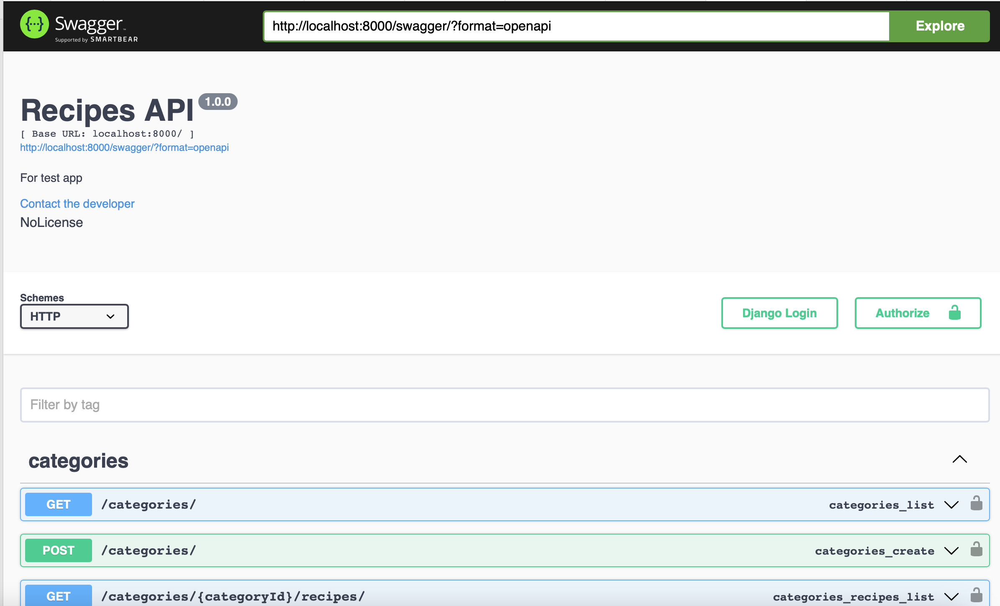

Привет, меня зовут **Алина** 👋

Учусь на курсе  

**Fullstack разработчик на Python**
 

Блок **Frontend-разработка**
# Recipes 🥗


[)](https://git.io/typing-svg)
___


**Задание:**


**Проект:**


### **Быстрый старт:**
**Для запуска проекта необходимо:**

1. Клонировать репозиторий 

    ➡️  [Github repository](https://github.com/Nimalia/F4-SF-Recipes.git)

2. Установить виртуальное окружение
    ```bash 
    python3 -m venv venv
    ```

    ```bash 
    source ./venv/bin/activate
    ```
3. Установить `requirements.txt`
    ```bash 
    pip install -r requirements.txt
    ```
4. Переходим в директорию:
    ```bash 
    cd f4recipe
    ```
5. Создать пользователя
    ```bash 
    python3 manage.py createsuperuser
    ```
6. Запустить сервер
    ```bash 
    python3 manage.py runserver
    ```

7. Перейдите в директорию React приложения, используя команду (в отдельном терминале)
 ```bash
cd frontend
```
8. Для успешного запуска приложения, вам необходимо находиться в корневой директории проекта, где находится файл ```package.json```. Если вы получаете ошибки, убедитесь, что вы находитесь в правильной директории и у вас установлены все необходимые зависимости, выполнив 
```bash
npm install
```
9. После того как вы находитесь в директории вашего приложения, выполните команду:

```bash
npm start
```


### **Структура приложения:**

1. Главная страница:


2. Страница категорий:


3. Страница рецептов:
  

4. Страница каждого рецепта:
  

5. Страница каждой категории:
  

Сделаны переходы из определенной категории в определенный рецепт и наоборот.


**🛠️Технические нюансы🔩**

1. Swagger 

Устанавливаем пакет:
```bash
pip install drf_yasg!
```

 ➡️ По настройкам можно почитать [здесь](https://www.django-rest-framework.org/topics/documenting-your-api/)


по итогу, переходя на http://localhost:8000/swagger/ 

получаем:
  


2. Разметка страницы делиться на :
- ```header```
- ```main``` 
- ```footer```

все это вынесено в отдельные js файлы: 
```bash
Header.js
Main.js
Footer.js
```
также вынесен функционал в отдельные компоненты:
```bash
Category.js /*список рецептов определенной категории*/

CategoryList.js 
/*список всех категорий*/

Recipe.js /*список всех рецептов*/

RecipeSingle.js /*определенный рецепт в подробном описании*/
```
все эти компоненты импортируются и собираются в общий файл - App.js


----
```` Спасибо за уделенное время! 🙏 ````

___


[](https://github.com/anuraghazra/github-readme-stats)