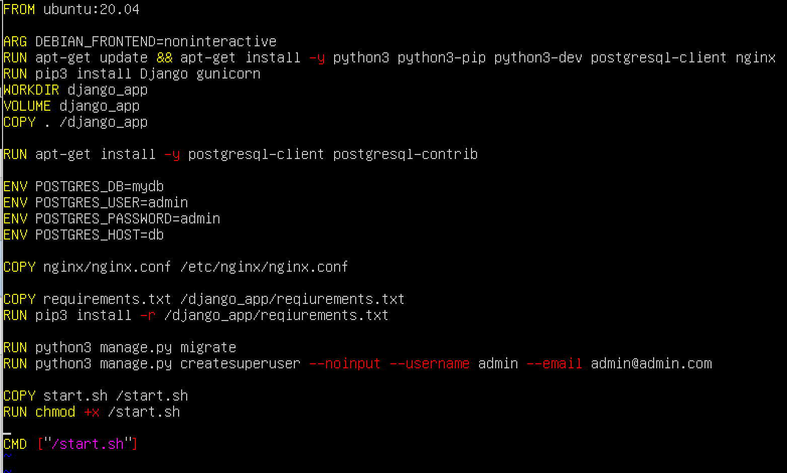
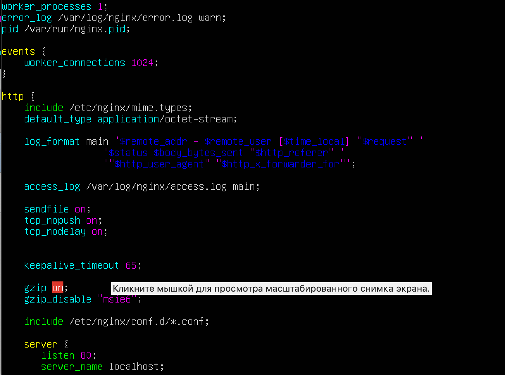
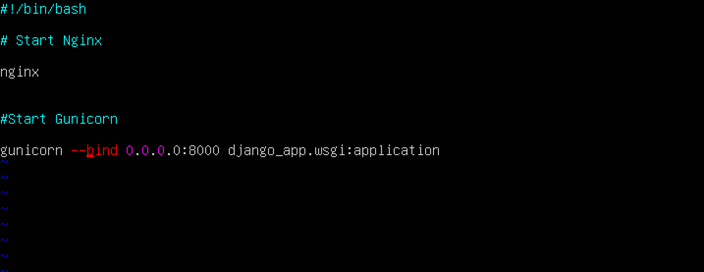

### **Быстрый старт:**
**Для запуска проекта необходимо:**

Скачать [образ Docker](https://hub.docker.com/repository/docker/nimalia3/django_app/general):

```bash 
docker pull nimalia3/django_app:latest
```
и запустить :
```bash 
docker run -p 8000:8000 -p 80:80 -p 5432:5432 nimalia/g4-sf-docker:latest
```

После завершения установки и запуска контейнеров, заходим в браузере по адресу:
 http://localhost:8000


**Технические моменты**

1. Установка Docker 

```bash 
curl -fsSL https://get.docker.com/ | sh 
 ```

2. Добавляем пользователя в группу ```docker```
```bash
sudo usermod -aG docker $(whoami)
```
3. Запустим службу и настроим автозапуск:
```bash
sudo systemctl start docker && sudo systemctl enable docker
```
4. Cоздать ```Dockerfile```
```bash
touch Dockerfile
vim Dockerfile
```
Для редактирования нажать 
```bash
i
```
для сохранения и выхода нажимаем 
```bash
esc 
: wq
```

```Dockerfile``` будет следующим:


5. ```nginx.conf``` будет следующим:




6. Запуск двух сервисов (Nginx и Gunicorn) в одной команде CMD не рекомендуется. Вместо этого, можно создать Bash-скрипт, который будет запускать оба сервиса, и вызвать этот скрипт из Dockerfile.  
Скрипт ```start.sh``` будет следующим:


6. ```requirements.txt``` будет следующим:
```bash
Django==3.2.8
gunicorn==20.1.0
psycopg2-binary==2.9.1
```
7. Построить образ (в той же директории, что и Dockerfile), запустив команду:
```bash
docker build -t django_app .
```
8. И запустим контейнер:
```bash
docker run -d --name djangocont -p 80:80 -p 8000:8000 django_app
```

📝 для проверки:
```bash
docker logs djangocont
```
9. Разместить образ на [Dockerhub](https://hub.docker.com/repository/docker/nimalia3/django_app/general):
 ```bash
 docker images
docker login
docker push nimalia3/django_app:latest
```